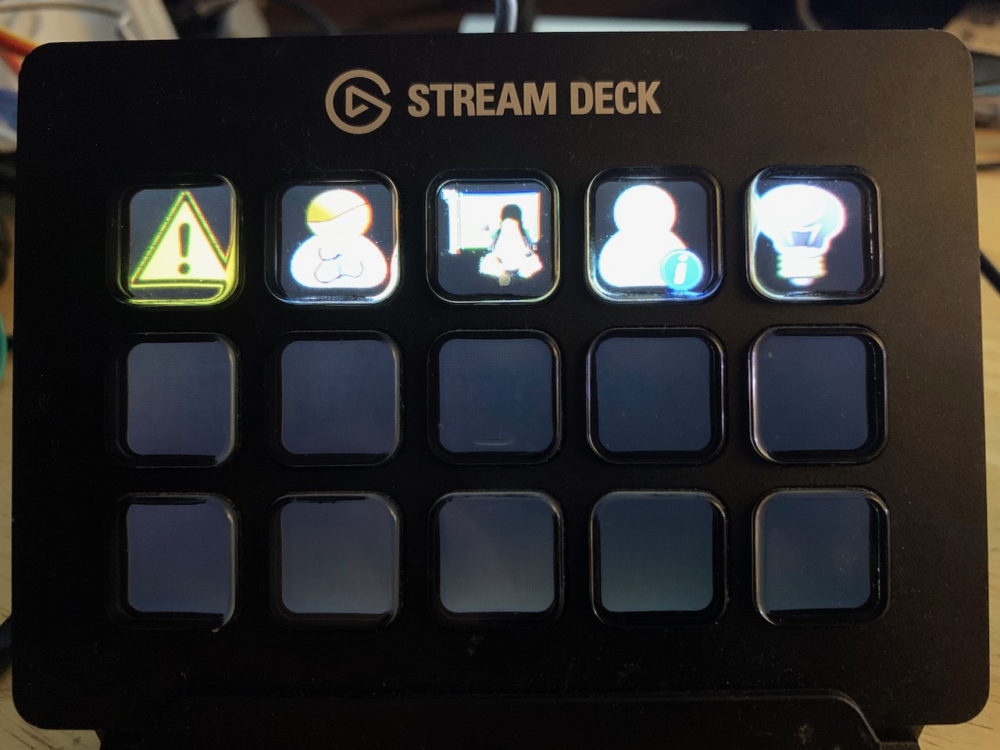
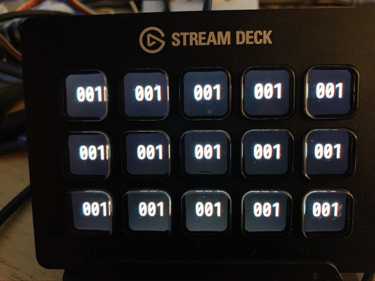
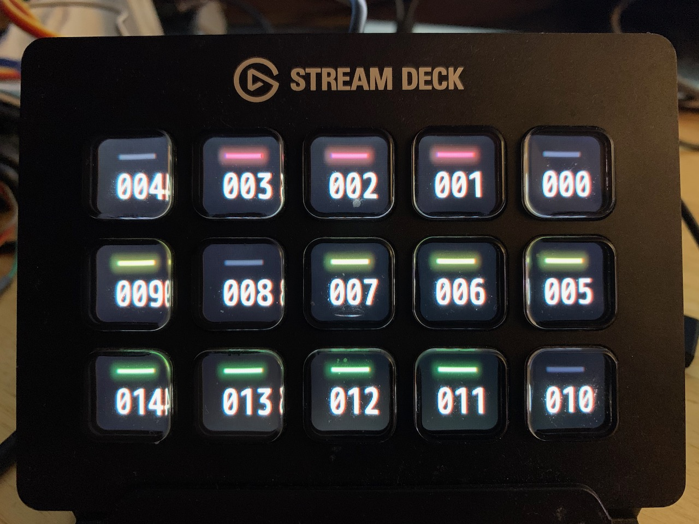
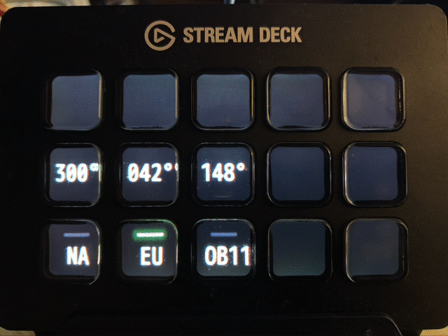
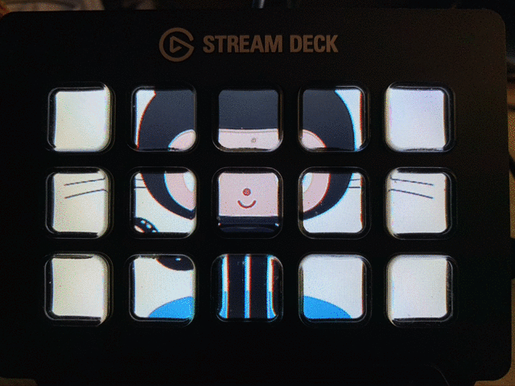
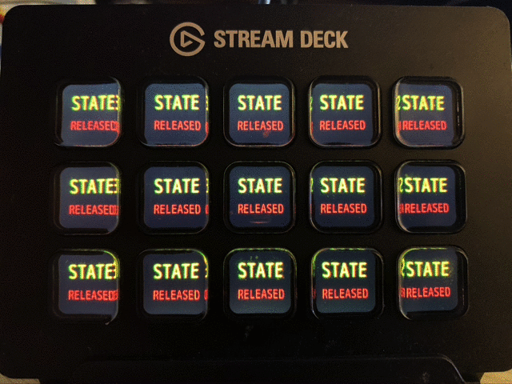

[](https://goreportcard.com/report/github.com/dh1tw/streamdeck-examples)
[](http://opensource.org/licenses/MIT)
[](https://pkg.go.dev/github.com/dh1tw/streamdeck-examples)


This repository contains a demo application with several examples on how the golang [streamdeck](https://github.com/dh1tw/streamdeck) driver could be used.

## Install

You can either grab a copy of the pre-compiled binary from the [releases page](https://github.com/dh1tw/streamdeck-examples/releases) or compile the program locally on your machine.

```bash

$ mkdir -p $HOME/go/src/github.com/dh1tw && cd $HOME/go/src/github.com/dh1tw
$ git clone https://github.com/dh1tw/streamdeck-examples.git
$ cd streamdeck-examples
$ go build
$ ./streamdeck-examples

This is a demo application for the golang streamdeck driver

Usage:
   [command]

Available Commands:
  enumerate   enumerate all connected Stream Decks
  help        Help about any command
  icons       place a bunch of icons on the streamdeck
  labels      show a bunch of labeled icons on the streamdeck
  ledbuttons  show a bunch of buttons with status LED
  pages       Custom nested pages with navigation
  slideshow   picture slideshow across all buttons
  textbuttons just buttons with custom text

Flags:
  -h, --help   help for this command

Use " [command] --help" for more information about a command.
```

## Include static assets in binary

To include the no-golang files like images and fonts you need to install and run Mark Bates awesome [pkger](https://github.com/markbates/pkger).

```
$ go get github.com/markbates/pkger/cmd/pkger
```

Then just run `pkger` in the root folder of this repository. `pkger` will create the `pkged.go` file which includes all the assets.

## Examples

### Enumerate

As one would expect, this examples enumerates all connected Stream Deck devices.

```bash
$ ./streamdeck-examples enumerate

Found 1 Elgato Stream Deck(s):
        SerialNumber:        AL37G1A00424

```

### Icons

The [icons example](cmd/icons.go) loads from different file formats (jpg, png, gif). The icons are placed on the first row of the Stream Deck. The lightbulb icon on button 0 (upper right corner) can be toggled.

```bash
$ ./streamdeck-examples icons
```



### Labels

The [labels example](cmd/labels.go) instantiates 15 text labels with an integer number on the Stream Deck. With the help of a counter, all numbers will be incremented every 100ms by 1. When a button is
pressed, the background is colored blue.

```bash
$ ./streamdeck-examples labels
```



### Ledbuttons

The [ledbuttons example](cmd/ledbuttons.go) shows how to use the custom designed [streamdeck-buttons/ledbutton](https://github.com/dh1tw/streamdeck-buttons/ledbutton) element. It will enumerate all the buttons on the panel with their ID and with a green LED which can be activated / deactivated with a button press.

```bash
$ ./streamdeck-examples ledbuttons
```



### Pages

The [pages example](cmd/pages.go) is the most complex example. It shows how to build an application
consisting of several linked and nested pages. Check out the [Page interface](https://pkg.go.dev/github.com/dh1tw/streamdeck?tab=doc#Page).

```bash
$ ./streamdeck-examples pages
```



### Slideshow

The [slideshow example](cmd/slideshow.go) creates a slideshow on the Stream Deck, across all buttons.
Images of different formats (png, jpeg, gif) are loaded, resized to match the panel and if necessary, cropped to the center.`,

```bash
$ ./streamdeck-examples slideshow
```


### Textbuttons

The [textbuttons example](cmd/textbuttons.go) creates a text multi-line text button using a third
party font. Whenever a button is pressed, the text is altered.

```bash
$ ./streamdeck-examples textbuttons
```
